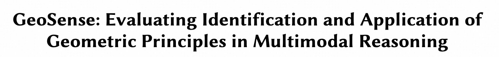
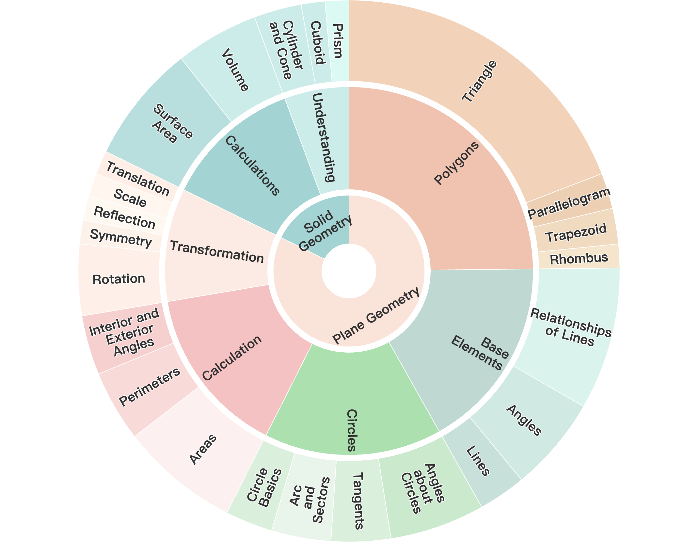
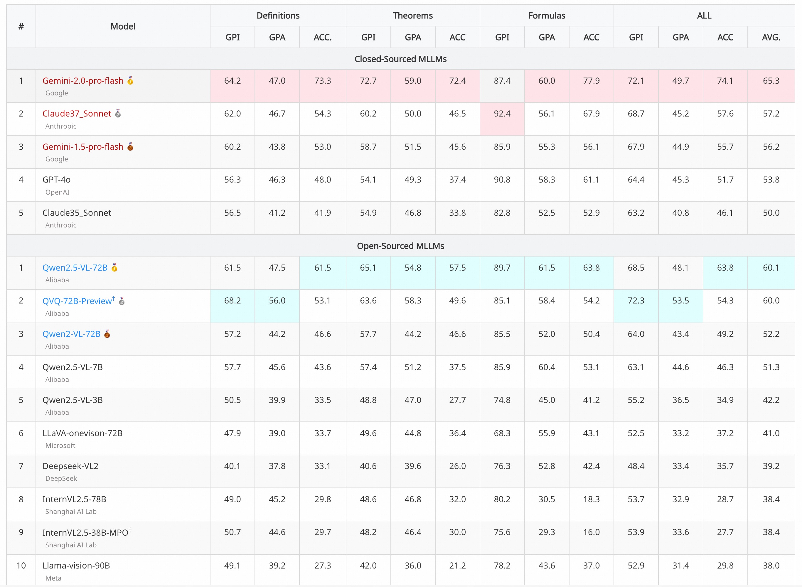

# Overview


<p align="center">
  
</p>
<p align="center">
   🌐 <a href="https://gfzshiwai.github.io/GeoSense_Project/" target="_blank">Website</a> • 🤗 <a href="https://huggingface.co/datasets/OpenStellarTeam/GeoSense" target="_blank">Hugging Face</a> • ⏬ <a href="#data" target="_blank">Data</a> •   📃 <a href="https://arxiv.org/abs/2504.12597" target="_blank">Paper</a><br>
</p> 


**GeoSense** is the first comprehensive bilingual benchmark designed to systematically evaluate the geometric reasoning abilities of MLLMs through the lens of **geometric principles**. GeoSense features a **five-level hierarchical** framework of geometric principles spanning plane and solid geometry, an **intricately annotated dataset** of 1,789 problems, and an **innovative evaluation strategy**. 
Please visit our [website](https://gfzshiwai.github.io/GeoSense_Project/) or check our [paper](https://arxiv.org/pdf/2502.11718) for more details. 

> This is the evaluation repository for GeoSense, and it follows the MIT License.

<p align="center">
  
</p>

## 💫 Introduction

* To comprehensively assess the reasoning abilities of MLLMs, we present **GeoSense**, which consists of a dataset containing 1,789 high-quality questions across 148 geometric principles (definitions, theorems, and formulas), spanning from plane geometry to solid geometry.  Specifically, the key features of our proposed GeoSense are as follows:
  * **5-level hierarchical framework of geometric principles:** GeoSense has established a five-layer knowledge hierarchy encompassing 148 geometric principles, covering 65 definitions, 47 theorems, and 36 computation formulas in both plane and solid geometry, providing a multidimensional and fine-grained evaluation of the model's ability to identify and apply knowledge when faced with geometric problems.
  * 🍀**Intricately annotated dataset:** GeoSense collects 1,789 geometric problems and provides detailed bilingual annotations for 5,556 geometric principles necessary for solving these problems, including their correspondence and application to elements in geometric diagrams. Special tags (\<note>) are used to mark key points in problem-solving to ensure comprehensive and accurate model evaluation. GeoSense follows a rigorous construction process, with 23 graduate students specializing in geometry conducting data annotation, review, and quality control.
  * ⚡**An innovative evaluation strategy:** GeoSense employs innovative evaluation methods, introducing two novel metrics: GPI (Geometric Principles Identification) and GPA (Geometric Principles Application). These metrics focus on assessing the model’s ability to identify and apply geometric principles in complex visual scenarios, helping to identify potential shortcomings and areas for improvement in the model’s reasoning process.

- Based on GeoSense, we have conducted a comprehensive evaluation of the reasoning capabilities of MLLMs. We also maintain a comprehensive leaderboard list. 


## 📊 Leaderboard

<p align="center">
  
</p>


## 🛠️ Setup

For the [OpenAI API](https://pypi.org/project/openai/):

```bash
pip install openai
```

For datasets, we provide the datasets with paths of images in `/data/GeoSense.jsonl` , you can download the images from [here](https://drive.google.com/drive/folders/1-X_X_X_X_X_X_X_X_X_X_X_X_X).


## ⚖️ Evals
We provide a simple single evaluation script that we wrote from scratch.  The startup command is as follows: 
- Step0: set your openai key in eval/GeoSense.py:
  Before evaluation, please use the following prompt to guide the model in generating inference results:
  ```
  Please reason step by step to arrive at the final answer. Note that you should clearly use theorems (or definitions) in the reasoning process, and explain how the theorem (or definition) specifically applies to this problem.

  The question to be answered is: {Question}
  ```
  and the structure of output data should be a jsonl file, and the data should be transfered like this format with model_output:
    ```
    {
      "image": ["geos_test/official/053.png"], 
      "predict": <model_output>
      }
    ```

- Step1: set your openai key in eval/GeoSense.py:

  ```
  API_CONFIG = {
        "api_key": "replace_with_your_key",
        "base_url": "replace_with_your_base_url"
        }
  ```

- Step2: run the eval script:

  ```
  python eval/GeoSense_EN.py \
        --generate_texts_path <model_output_path> \
        --model_name <model_name> \
        --output_dir <output_dir>
  ```
  or 
    ```
  python eval/GeoSense_CH.py \
        --generate_texts_path <model_output_path> \
        --model_name <model_name> \
        --output_dir <output_dir>
  ```
The file in `generate_texts_path` is the jsonl file generated in step0.


## Citation

Please cite our paper if you use our dataset.

```
@misc{xu2025geosenseevaluatingidentificationapplication,
      title={GeoSense: Evaluating Identification and Application of Geometric Principles in Multimodal Reasoning}, 
      author={Liangyu Xu and Yingxiu Zhao and Jingyun Wang and Yingyao Wang and Bu Pi and Chen Wang and Mingliang Zhang and Jihao Gu and Xiang Li and Xiaoyong Zhu and Jun Song and Bo Zheng},
      year={2025},
      eprint={2504.12597},
      archivePrefix={arXiv},
      primaryClass={cs.CL},
      url={https://arxiv.org/abs/2504.12597}, 
}
```